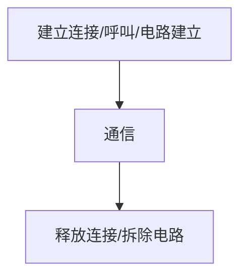

# 网络中的掌中宝
通过路由器实施的异构互联
# 为什么要数据交换
- **第一种**
    - 对于每台主机要通信，我们给**每个主机都建立线路**，那么一共是 n(n-1)/2 条链路 
    - 
- **第二种**
    - 通过交换设备互联，N 条链路
    - 缺点：**如果主机数量大，将会给交换机压力很大，交换机的内部吞吐量要特别大，并且远距离链路就要长，链路一长信号会差**
    - 
- **第三种**
    - 通过交换网络
    - 由**大量的交换设备互联而构成**的，这样既对**交换设备的端口要求不是很大**，可能几个端口十几个端口就可以了。另外也**可以实现远距离之间的通信**
    - 
	<!--more-->
## 数据交换方式
### 电路交换
**例子：电话网络**  
  
**电路交换的阶段**：  

> 特点： 独占资源  

要建立一个连接在电话网络中，通过呼叫的方式来建立好这样一个电路，建立好连接，那连接只要一建起两个人就可以进行通信，也就是进行数据的交换和数据的传输。通信结束之后就是释放连接的一个过程，拆除电路的过程。  

结合这个图我们可以再来看一下，假如说现在这个是A和BA和B他们两个人要打电话，那A先拨号，拨通之后B就收到了一个振铃，收到这零之后，B就接通电话，相当于两个人之间就已经建立好了一个电路的连接。  
  
只要建立好连接，就会有一个固定的路径来传输数据，现在假如我们A和B之间所建立好的这样一个链路或者说电路，它们的带宽非常的大。也就是说这个电路其实可以通过非常多的数据量，但是现在只有一个人在打电话，现在其实相当于是对带宽有浪费了。

- **优点**
    - **通信时延小**
    - **有序传输**
    - **没有冲突**
    - **实时性强**
- **缺点**
    - **建立连接时间长**
    - **线路独占，使用效率低**
    - **灵活差**
    - **无差错控制能力**

### 报文交换
**报文：源应用发送的信息整体**     
  
> 如果报文不大，也就不进行分割处理  

**首先**它就会到这样**一个交换设备**上，**交换设备通常使用的都是一个交换机**，这个交换机它**具有存储转发的功能**。**什么叫存储转发**？就是指报文到了交换设备，这并不像刚才的电路交换一样直接就发出去了，而是要**先存一会，存到什么时候？存到这个电路是可用的**，就可以把它转发出去，也就是说如果有**链路空闲我们就可以转发出去**，而这个链路可以走上面也可以走，下面取决于当时的一个网络情况，所以可以看到它这个**路径并不是固定的**，而且也**并不像电路交换一样事先约定好一个路径**，它是可以比**较随机性的进行一个游走的**，所以报文交换就是这样一个过程。    
- **优点**
    - **无需建立连接**
    - **存储转发，动态分配线路**
    - **线路可靠性较高**
    - **线路利用率较高**
    - **多目标服务**
- **缺点**
    - **存储转发时延**
    - **报文大小不定，需要的网络节点要有较大的缓存空间**

### 分组交换
**分组：把大的数据块分割成小的数据块**    
  

它们**都采用**一个**存储转发的思想**，但是他们所**转发的数据大小**，或者说这个数据究竟是什么？这一点是不一样的。**他转发的是分组**，**分组指的就是把大的数据块分割成一个小的数据块**，那也就是把之前我们讲的**报文给它切割成一个一个又一个小的数据块**，再进行一个**存储和转**发，那这个**分组**可以是**相同大小**，也可以是**不同大小**，我们默认它是一个相同大小的分组   

- **优点**
    - **无需建立连接**
    - **存储转发，动态分配线路**
    - **线路可靠性较高**
    - **线路利用率较高**
    - **相对于报文交换，存储管理更容易**
- **缺点**
    - **存储转发时延**
    - **需要传输额外的信息量**
    - **乱序到目的的主机，要对分组排序重组**

### 三种交换方式的比较  
  
1. **电路交换**
    - 电路交换就是要**先建立好链接**，然后**再传送数据**，最后**再释放连接**，可以看到连接建立的过程是非常长的，而且在**数据传送的过程当中是独占资源的**。 
2. **报文交换**
    - 报文交换就是对应于一个报文，我们**不需要事先建立连接**，**直接把它放到链路上进行一个传输**，而且也并**不是占用整个的从源主机到目的主机之间的路径**，而是在**不同时间内一段一段的占用链路**。 
3. **分组交换**
    - **分组交换和报文交换一样都是采用存储转发**的这种技术，而且也**不需要**是先**建立连接**，只不过**他们**两个**传送的单元不同**，**报文交换**传送的**单元是报文**，比较大的一个数据块儿，**分组交换**是把这个大的数据块分片了**分成一小块的数据块**，所以这是分组交换和报文交换的一个区别。而且根据数轴的时间轴的方向可以看到**分组交换它整个的时延是要比报文交换更少一些的** 
  
#### 区别
1. **报文交换和分组交换都采用存储转发技术**。 
2. **如果传送的数据量大，而且传送时间远大于呼叫时间，我们都会选择电路交换**。
    -  电路交换的传输实验是最小的，因为我们知道电路交换他不需要经历存储转发，也可以叫做是一种直通式的
3. **从信道利用率来看，报文交换和分组交换是要优于电路交换的，而且分组交换的时延总是要更短。**
