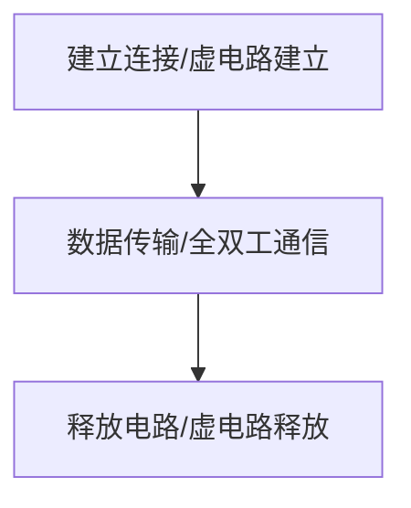

# 数据报服务/虚电路服务
- **数据报方式**
    - 为网络层提供**无连接方式**
    - **无连接服务**
        - 是不是先为分组的传输确定一个具体的路径，每个分组他会独立的确定传输路径，不同分组传输路径可能不同
- **虚电路服务**    
    - 为网络层提供**连接方式**
    - **连接方式**
        - 连接服务自然就是相反，要首先为分组的传输确定一个传输的路径，也就是要建立连接，然后沿着该连接传输系列分组这系列分组它们的传输路径都是相同的
	
<!--more-->
# 几种传输单元名词辨析 
  
- **报文**
    - 其实就是对于一个要传输的数据。比如说我现在要发送一个文件，比如说现在使用QQ，QQ它就是应用层的程序，要用QQ来发送一个文件，这一个文件其实就是一个报文。
- **报文段**
    -  传输层会对报文进行一个分割，也就是把报文分割成一个又一个的小段，就叫做报文段，这个是对于报文长度比较大，报名比较大的情况，传输层才会进行分割。如果这报文很小，比如说就是一句话，你好，可能传输层它并不会进行分割，不会分割成报文段，也可以叫做报文
- **IP数据段，分组**
    - 它要封装上网络层的ip地址，这个地址包括原地址以及目的地址，都是ip地址。封装好这样一个就叫做一个ip数据报了。如果这个数据报大小再次过大的话，因为链路层的时候，它有一个 MTU 最大传送单元，如果这个数据报的部分过大，我们就需要对数据报进行一个切割，进行一个切割下来的一个部分，就叫做一个分组。
- **帧**
    - 加头加尾，就形成了一个帧，这个头加的就是在原来的ip数据报，或者说分组基础之上，我们家头加上mac地址，加上物理地址，然后加尾就是加一个FCS的帧检验序列。
- **比特流**

# 数据报
 
- **特点**
    - **无连接**
        - 交换方式：无连接 
        - 事先未分组的传输，确定传输路径，每个分组会独立地确定传输路径，不同分组传输路径可能不同
    - **每个分组携带源和目的地址**
    - **路由器根据分组的目的地址转发分组**
        -  基于路由协议/算法构建转发表：检索转发表；每个分组独立选路  

# 虚电路
> **把数据报方式和电路交换方式进行一个结合，来发挥两者的优点**  

指的是**一条源主机到目的主机之间类似于电路的一条路径**，那这个**路径它是类似于电路的**，是一种**逻辑上的连接**，所以它是**虚的电路**，而**路径上的所有节点都要维持这条虚电路的建立**，都**维持一张虚电路**表，每一项记录，**每一项都记录了一个打开的虚电路的信息**。  

**建立连接**：  
发送的是分组，每个分组携带虚电路号，而非目的地址。  
  
源主机发送“呼叫请求”分组，并收到“呼叫应答”分组才算建立连接。  
**释放连接**:  
源主机发送“释放请求”，分组以拆除虚电路。  
# 区别

   1 |  数据报服务 | 虚电路服务
---|---|---|
**连接的建立** | 不要|必须有
**目的地址** | 每个分组都有完整的目的地址|仅在建立连接阶段使用，之后每个分组使用长度较短的虚电路号
**路由的选择** | 每个分组独立的进行路由选择和转发|属于同一条虚电路的分组按照同一路由转发
**分组顺序** | 不保证分组有序到达|保证分组的有序到达 
**可靠性** | 不保证可靠通信，可靠性由用户主机保证|可靠性由网络保证
**对网络故障的适应性** | 出故障的结点丢失分组，其他分组路径选择发生变化，可正常传输|所有经过故障结点的虚电路均不能正常工作
**差错处理和流量控制** | 由用户主机进行流量控制，不保证数据报的可靠性|可由分组交换网负责，也可由用户主机负责

    

